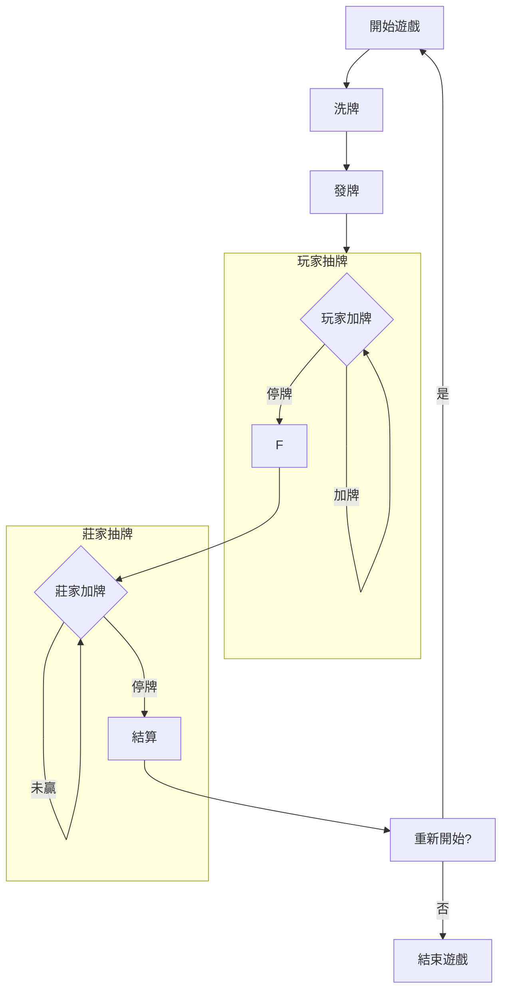

## bdd_prac
Using Python to implement BDD (Behavior-Driven Development) tests to verify the correct functionality of a custom-built Blackjack (21) game

### 使用語言及技術
Python、軟體工程

### 測試流程

```mermaid
graph TD
    A[開始遊戲] --> B[洗牌]
    B --> C[發牌]

    subgraph 玩家抽牌
      E{玩家加牌}
      E -->|加牌| E
      E -->|停牌| F
    end

    C --> 玩家抽牌

    subgraph 莊家抽牌
          G{莊家加牌}
          G -->|未贏| G
          G -->|停牌| H[結算]
    end

    F --> G
    H --> I[重新開始?]
    I -->|是| A
    I -->|否| J[結束遊戲]
```
